# Mp3TagTool
## 準備
ffmpeg.exeをダウンロードし、パスを通しておいてください。本ツールはffmpegを使用してMP3のタグを編集します。

## 使い方
Mp3TagsTool.cmdを起動します。

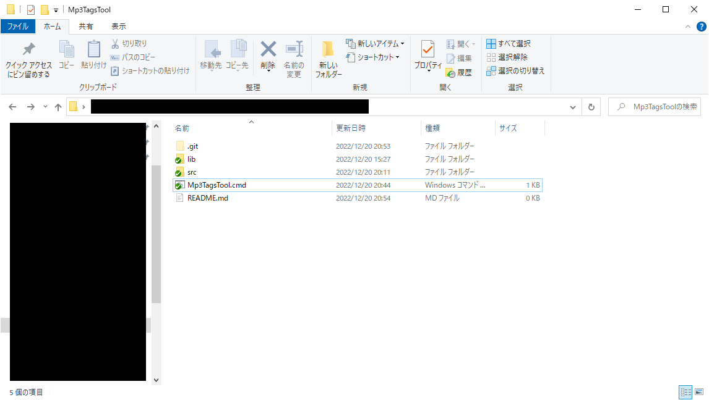

~~クソみたいな~~使いづらいGUIですが頑張って対象のフォルダまで移動します。
親のフォルダへ移動するときは【 \*ひとつ上の親フォルダ\* 】を選択してください。決定する場合は【 \*このフォルダを開く\* 】を選択してください。

また、残念ながらドライブを越えた移動はできません。南無。

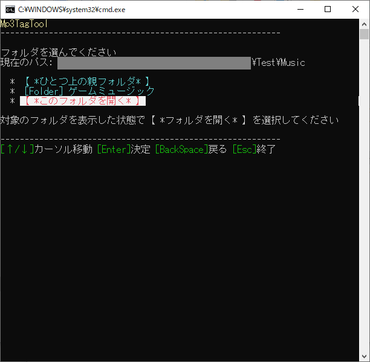

ちなみに、この例でのフォルダの内容物はこんな感じです。

ファイルやフォルダの先頭に番号を振っている場合は、それを自動で取り除くことが可能です。また、ファイルの先頭についている番号はそのままトラック番号に設定できます。

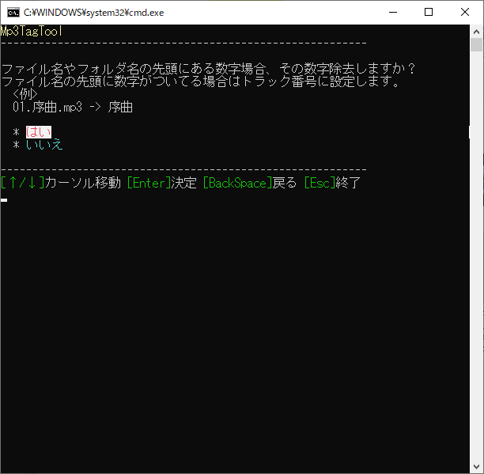

区切り文字を設定することで、先頭についている番号と文字列の区切りを判別します。とりあえず良く使え割れる5種類の文字をピックアップしましたが、全角文字が使用されていたり区切り文字無しで命名されている場合は現状対応できません。

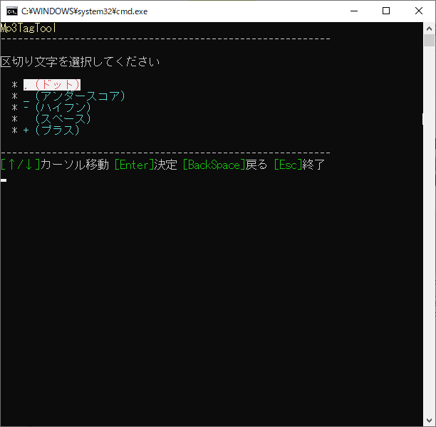

「はい」を押すと次に進みます。

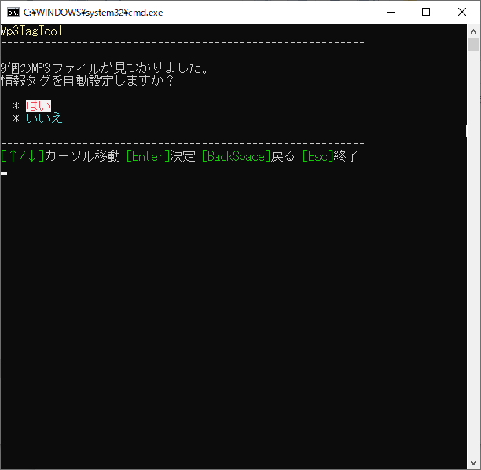

対象の親フォルダ～MP3ファイルまでに存在するフォルダの名前を、どのタグに対応させるか決定してください。

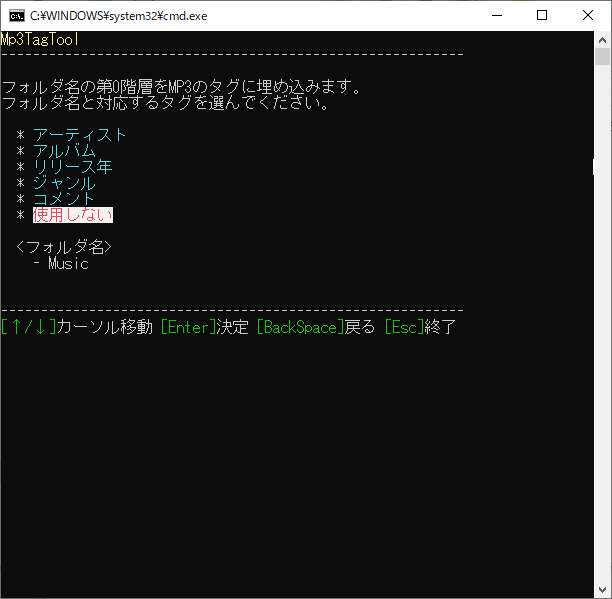

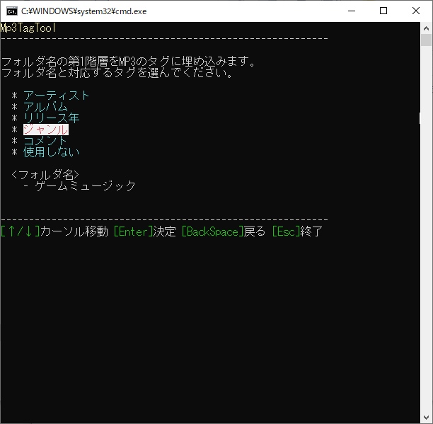

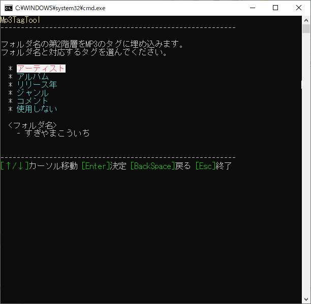

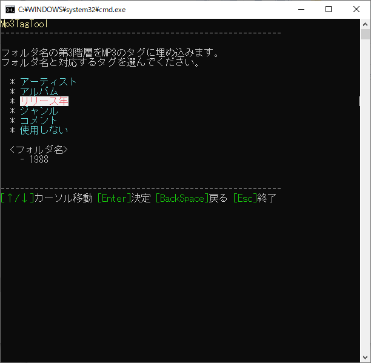

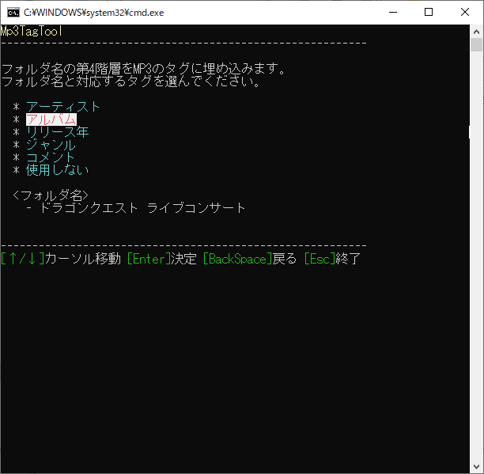

「はい」を選ぶとタグを編集します。

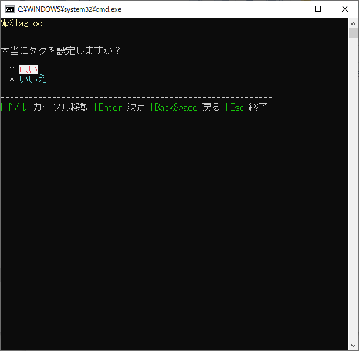

しばらくするとファイルのメタデータが編集されます。

結果

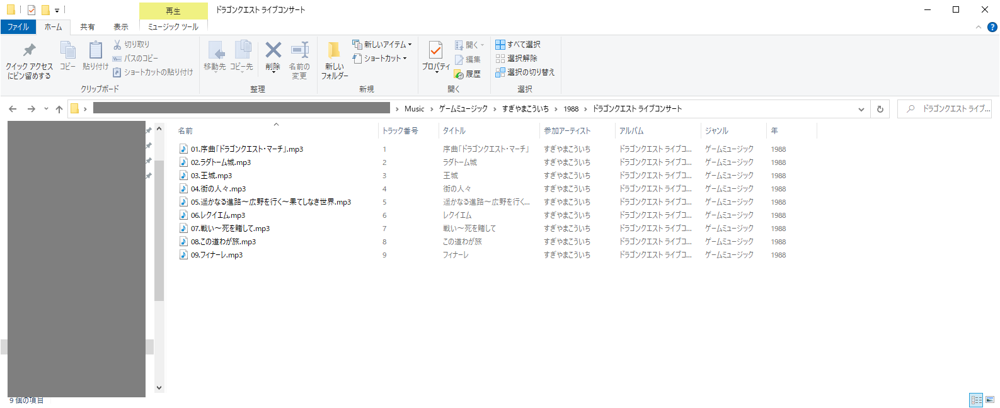
